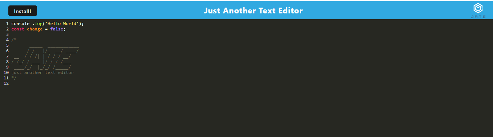

# Text-Editor

## Description

This app is a simple text editor that helps write code no matter where you are.

## Table of Contents (Optional)

If your README is long, add a table of contents to make it easy for users to find what they need.

- [Installation](#installation)
- [Usage](#usage)


## Installation

run the command:
```
npm start
```

## Usage



Simply open the page on http://localhost:3000/ once the app is running to sart coding

To see the full code visit https://github.com/Gator2-0/Text-Editor